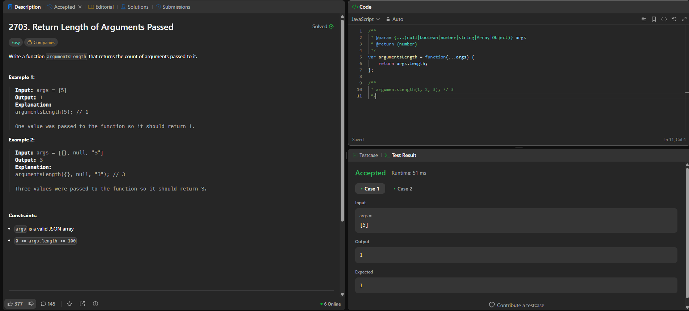

# LeetCode 2879 - Display First Three Rows

📅 **Date Solved:** July 17, 2025  
🧠 **Language:** Python, Pandas  

---



## Problem Summary

Write a function `argumentsLength` that returns the count of arguments passed to it.

### Example 1:
```js
argumentsLength(5); // Output: 1
```

### Example 2:
```js
argumentsLength({}, null, "3"); // Output: 3
```

## My Solution (JavaScript)
```js
/**
 * @param {...(null|boolean|number|string|Array|Object)} args
 * @return {number}
 */
var argumentsLength = function(...args) {
    return args.length;
};

/**
 * argumentsLength(1, 2, 3); // 3
 */
```

## What I Learned
- How to use the rest parameter (...args) in JavaScript
- args.length directly gives us the count of passed arguments
- This is a good intro to JavaScript function parameter flexibility

## What I Can Improve
- Should test edge cases like no arguments passed
- Practice similar questions with logic inside the function, not just parameter handling
